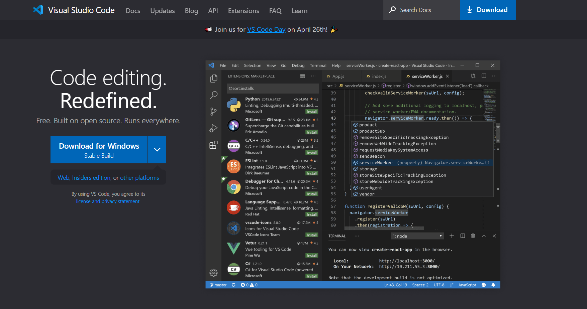
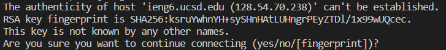
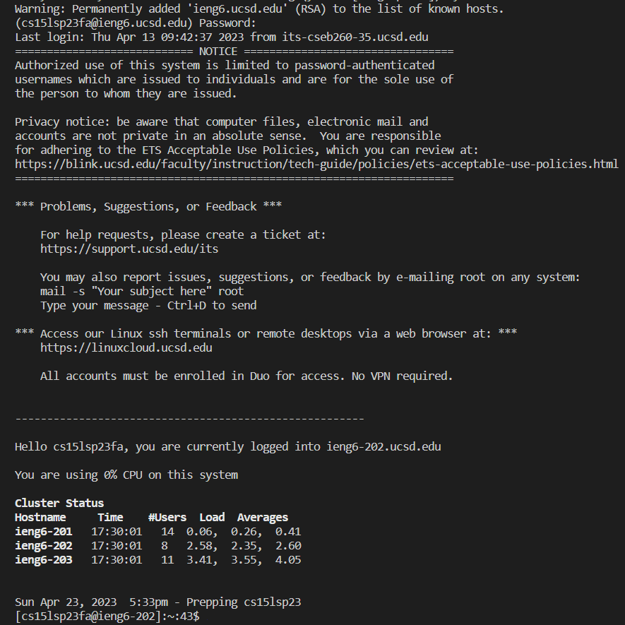
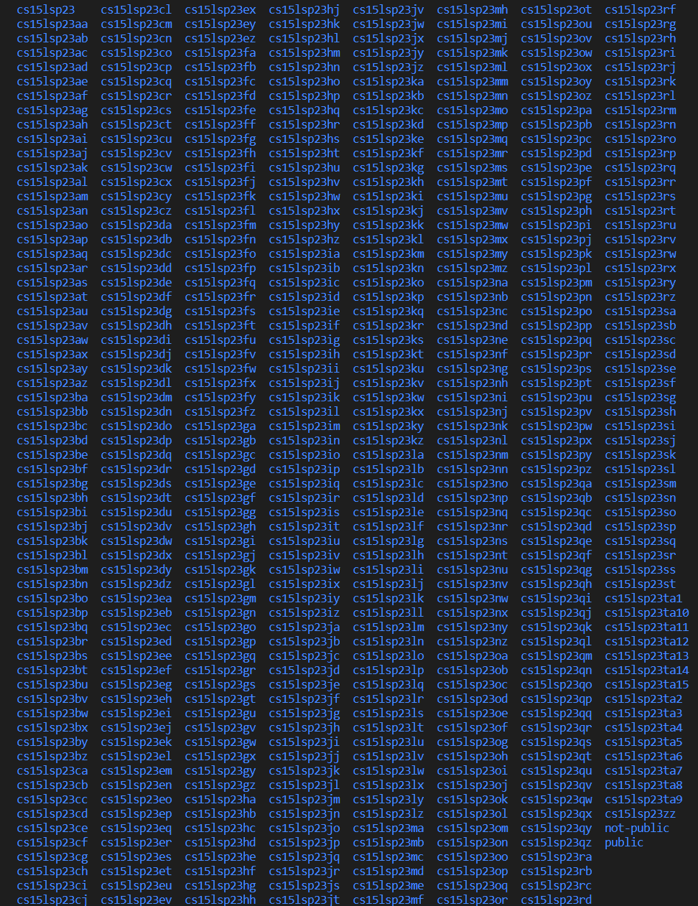

# Lab Report 1
This is a tutorial for incoming 15L students on how to log into a course-specific account on ieng6.\
_(Note that this tutorial is meant for Windows)_

## Installing VSCode
To install VSCode use the following link:\
[VSCode](https://code.visualstudio.com/)\
The webpage should look like this:\

When installing, you can just use all of the default settings, however you will later need to set up a terminal for Bash.\
These two programs are recommended but may not be required:


[Git](https://gitforwindows.org/)\
[GitHubDesktop](https://desktop.github.com/)


For windows, click the link and follow the instructions to install Bash:


[Steps to Install Bash](https://stackoverflow.com/a/50527994)

## Remotely Connecting 

[Account Lookup](https://sdacs.ucsd.edu/~icc/index.php)\
Your course account name will be under "Additional Accounts" beggining with "cs15l".


Open a terminal and input the command:
```
$ ssh cs15lsp23zz@ieng6.ucsd.edu
```
If this is your first time connecting, you should see the following prompt:
\
Type “yes” and click Enter.\
It will then ask for your course specific password. When typing the password the characters will be invisible. If the inputted password is incorrect, it will ask you again.\
Upon correctly inputting the password, the following message should appear, meaning you are logged in and connected:\


## Trying Some Commands

You can now type the following command to list all cse15L accounts:
```
$ ls /home/linux/ieng6/cs15lsp23/ 
```
The account list should look like this:


Adding /public to the end of the previous command will allow you to view the files inside the public folder. \
You can then use 
```
$ cp /home/linux/ieng6/cs15lsp23/public/hello.txt ~/
```
to copy the file and
```
$ cat /home/linux/ieng6/cs15lsp23/public/hello.txt
```
to read the contents of the text document.\
To log out you can type the command:
```
$ exit
```
