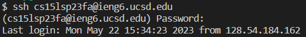
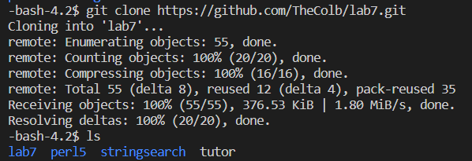
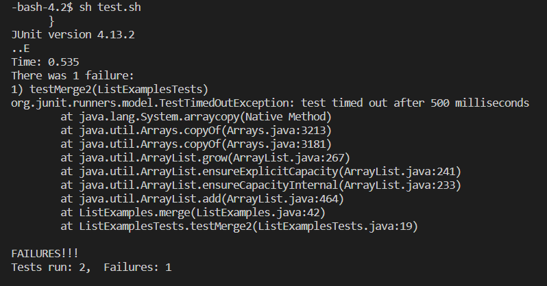
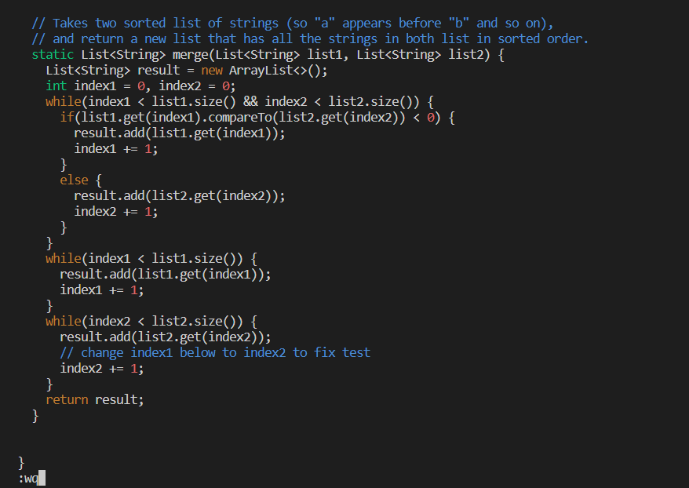
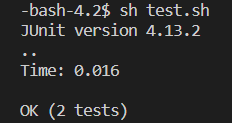
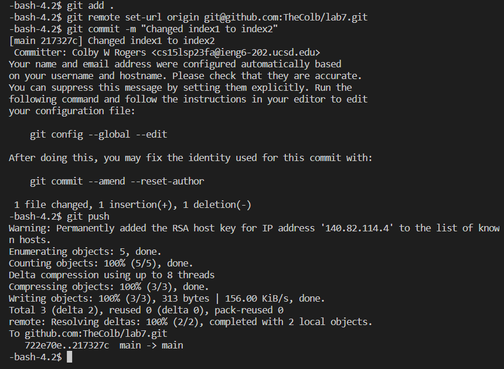

# Step 4
`<ssh cs15lsp23fa@ieng6.ucsd.edu> <enter>` // *connects to server*\
`<password> <enter>` // *Do not need to input password if a trusted connection is set up*\

# Step 5
`<git clone https://github.com/TheColb/lab7.git>` // *clones the repository to your active directory*\
// *inputting the command `<ls>` here is good to ensure that it was cloned correctly*\

# Step 6
`<cd lab7> <enter>` // *move to a terminal location within the lab7 file for conviencence* \
`<sh test.sh> <enter>` // *runs the default shell test from a bash script (This should fail)*\

# Step 7
`<vim ListExamples.java> <enter>` // *opens VIM*\
`<:><4><4> <enter>` // *go to line 44*\
`<w> <left arrow>` // *move forward a word, and go back one character*\
`<i> <backspace> <2> <esc>` // *enter insert mode, and replace the 1 with a 2*\
`<:><w><q> <enter>`// *save and quit vim*

# Step 8
`<sh test.sh> <enter>` // *runs the test from the bash script again (it should work this time!)*\

# Step 9
`<git add .>` // *Adds all modified and new files to the staging area.*\
`<git remote set-url origin git@github.com:TheColb/lab7.git> <enter>` // *Changes the remote URL to the specified GitHub repository.* \
// *shoutout ChatGPT for generating that command when I gave it my problem!* \
`<git commit -m "Changed index1 to index2"> <enter>` // *Creates a commit with the given message*\
`<git push> <enter>` // *Uploads local commits to the configured remote repository*\
 \
All done! Your changes should now be in your GitHub repository!
