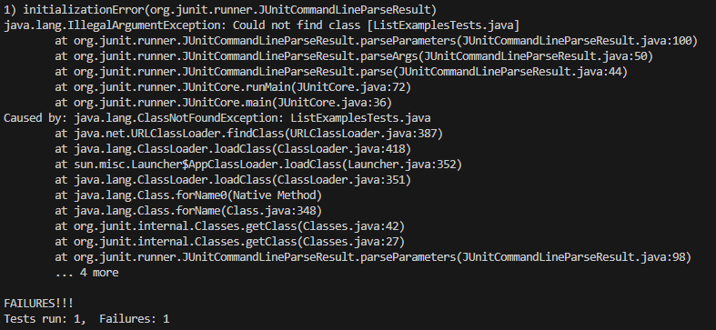
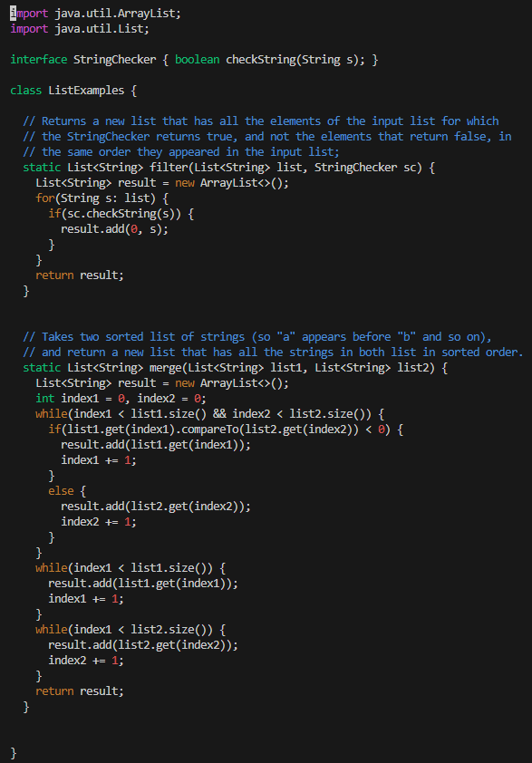
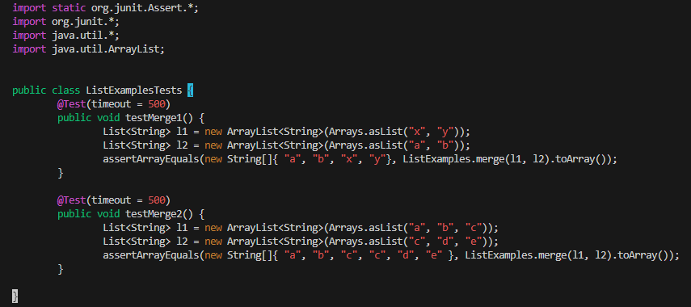
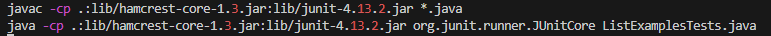
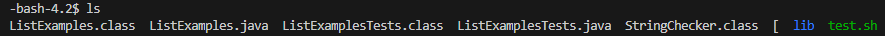
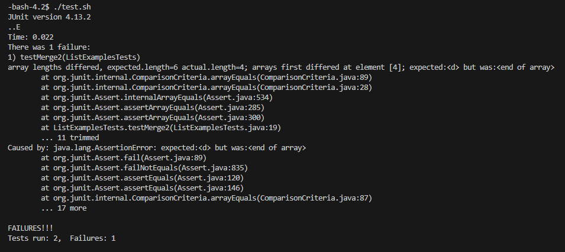
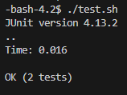

# Debugging Scenario

## Edstem Post

\
Title: Failure running my tests.\
\
**What environment are you using (computer, operating system, web browser, terminal/editor, and so on)?** \
\
I am on my home PC, running Windows 10, and VSCode on my terminal.\
\
**Detail the symptom you're seeing. Be specific; include both what you're seeing and what you expected to see** \
**instead. Screenshots are great, copy-pasted terminal output is also great. Avoid saying “it doesn't work”.** \
\
I tried to recreate the tests and bash script from lab3 by typing it out myself, but get an error upon running it.
Here is the error from my input:\
 \
Here is ListExamplesjava in vim:\
 \
Here is ListExamplesTestsjava in vim: \
 \
Here is test.sh in vim: \
 \
\
I am expecting to see both tests pass, but I cannot find the bugs in my code that cause this error.\
\
**Detail the failure-inducing input and context. That might mean any or all of the command you're running, a 
test case, command-line arguments, working directory, even the last few commands you ran. Do your best to
provide as much context as you can.**
\
The directory only has the following: 
 \
Upon inputting "./test.sh" the failure occurs.
## TA Response
Hi there, it appears that the primary error is that it cannot find the class ListExamplesTests.java \
to run the program. In test.sh you are trying to run ListExamplesTests.java instead of the class \
ListExamplesTests. To fix change the last part of the second command in test.sh to be \
"java -cp .:lib/hamcrest-core-1.3.jar:lib/junit-4.13.2.jar org.junit.runner.JUnitCore ListExamplesTests"
## Student Response
I changed that line and ran ./test.sh and got the following error:\
 \
This means that the program initialized, and I was able to fix the error in the code on my own!\
After a bit of testing on my own, I got the tests to pass: \

# Reflection
During the second half of the quarter, the most important thing I learned how to use was Vim.\
The ability to do things on a computer from the command line is immensely useful, especially \
recently, when I was locked out of my computer and had to copy everything  to a HDD only using\
the command terminal.
